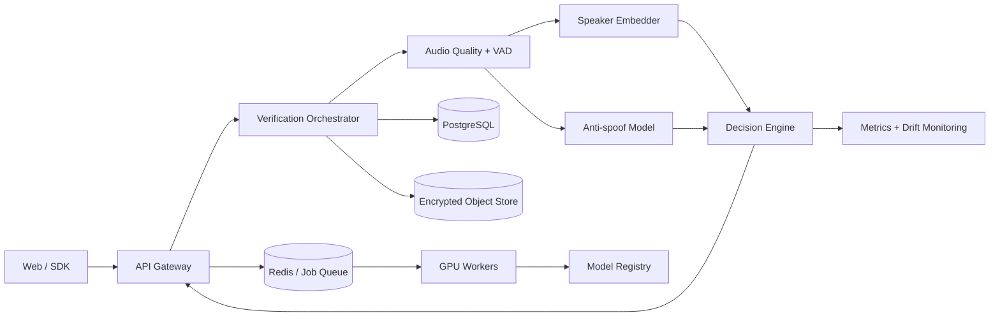

# VoiceID

VoiceID es una plataforma de **verificación de hablante con detección de ataques por voz**. El objetivo no es reconocer qué se dijo, sino estimar si una muestra pertenece a una identidad registrada y si el audio parece auténtico.

El repositorio comienza con una demo web local y un núcleo de dominio probado. La hoja de ruta incorpora inferencia con PyTorch, evaluación biométrica, almacenamiento seguro, una API asíncrona y MLOps.

## Qué demuestra el proyecto

- Procesamiento de audio: normalización, VAD, control de calidad y segmentación.
- Deep learning: embeddings ECAPA-TDNN y clasificación anti-spoofing.
- Lógica biométrica: enrollment, centroides robustos, cosine scoring y calibración.
- Evaluación: FAR, FRR, EER, ROC-AUC, minDCF y análisis por condiciones.
- Arquitectura: dominio desacoplado, adaptadores de modelos, API, workers y eventos.
- MLOps: datasets versionados, experiment tracking, model registry y monitoring.
- Seguridad y privacidad: plantillas revocables, cifrado y política de retención.

## Arquitectura objetivo



La explicación completa está en [docs/architecture.md](docs/architecture.md).

## Estado actual

- Demo de UX ejecutada completamente en el navegador.
- Núcleo Python para enrollment robusto, cosine scoring y fusión antifraude.
- Pruebas unitarias del motor de decisión.
- Diseño de arquitectura y roadmap incremental.

La demo web aún usa características acústicas sencillas. No debe considerarse autenticación biométrica.

## Ejecutar la demo

```bash
python3 -m http.server 8080
```

Abre `http://localhost:8080`.

## Ejecutar las pruebas del dominio

No requieren instalar dependencias:

```bash
python3 -m unittest discover -s tests -v
```

## Próximo incremento

Implementar el servicio de inferencia con un adaptador ECAPA-TDNN preentrenado, extraer embeddings reales y ejecutar un benchmark reproducible sobre VoxCeleb antes de conectar el resultado a la interfaz.

## Referencias técnicas

- [SpeechBrain ECAPA-TDNN](https://speechbrain.readthedocs.io/en/stable/API/speechbrain.lobes.models.ECAPA_TDNN.html)
- [Modelo preentrenado SpeechBrain/VoxCeleb](https://huggingface.co/speechbrain/spkrec-ecapa-voxceleb)
- [ASVspoof 2021](https://www.asvspoof.org/index2021.html)
- [MLflow Tracking](https://mlflow.org/docs/latest/tracking)
