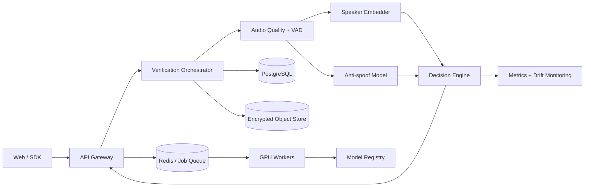

# VoiceID

VoiceID is a **speaker verification and voice attack detection platform**. Its purpose is not to recognize what was said, but to determine whether a voice sample belongs to an enrolled identity and whether the audio appears authentic.

The repository currently combines a local web demo with a tested, framework-independent domain core. The roadmap adds PyTorch inference, biometric evaluation, secure storage, an asynchronous API, and MLOps.

## What this project demonstrates

- Audio processing: normalization, voice activity detection, quality analysis, and segmentation.
- Deep learning: ECAPA-TDNN speaker embeddings and anti-spoofing classification.
- Biometric logic: enrollment, robust centroids, cosine scoring, and calibration.
- Evaluation: FAR, FRR, EER, ROC-AUC, minDCF, and condition-based analysis.
- Architecture: decoupled domain logic, model adapters, APIs, workers, and events.
- MLOps: versioned datasets, experiment tracking, a model registry, and monitoring.
- Security and privacy: revocable templates, encryption, consent, and retention policies.

## Target architecture



See [the architecture document](docs/architecture.md) for component boundaries, evaluation criteria, the threat model, and the delivery roadmap.

Progress is tracked explicitly in the [delivery roadmap](docs/roadmap.md).

## Current status

- Browser-based UX prototype with local audio processing.
- Python core for robust enrollment, cosine scoring, and anti-spoofing decision fusion.
- Defensive PCM WAVE decoding, 16 kHz resampling, signal normalization, and quality analysis.
- Replaceable energy-based VAD baseline with explicit speech segments.
- Real 192-dimensional ECAPA-TDNN speaker embeddings through a lazy SpeechBrain adapter.
- Multi-sample enrollment with quality gates, outlier rejection, and versioned templates.
- One-to-one speaker verification with auditable decisions and provisional policy versioning.
- Versioned FastAPI endpoints with bounded multipart uploads and stable error contracts.
- Unit tests covering the biometric decision engine.
- Target architecture and incremental roadmap.

The browser prototype still relies on basic acoustic features. It must not be treated as a biometric authentication system.

## Run the web demo

Microphone access requires a secure browser context. Start a local server:

```bash
python3 -m http.server 8080
```

Then open `http://localhost:8080`.

## Run the domain tests

The current test suite has no third-party dependencies:

```bash
python3 -m unittest discover -s tests -v
```

## Install the ML environment

The lockfile makes the local ML environment reproducible:

```bash
uv sync --extra ml --extra api --extra dev
```

Extract and validate an embedding from a 16-bit PCM WAVE file:

```bash
uv run python scripts/extract_embedding.py path/to/sample.wav
```

The command reports the model identifier, dimension, norm, and usable speech duration. It intentionally does not print the embedding values.

Run an ephemeral multi-sample enrollment:

```bash
uv run python scripts/enroll_identity.py demo-user sample-1.wav sample-2.wav sample-3.wav
```

This command exercises the real preprocessing and ECAPA pipeline but deliberately uses in-memory persistence. Durable biometric storage is scheduled for Step 9.

Run the complete ephemeral enrollment and verification workflow:

```bash
uv run python scripts/verify_identity.py demo-user sample-1.wav sample-2.wav sample-3.wav \
  --probe probe.wav
```

The initial `provisional-cosine-v1` policy is useful for integration testing only. It has not been calibrated to a measured FAR, FRR, or EER.

Start the HTTP API:

```bash
uv run uvicorn voiceid.adapters.api.app:app --host 127.0.0.1 --port 8000
```

Open `http://127.0.0.1:8000/docs` for the interactive API contract or read the [HTTP API guide](docs/api.md).

## Next milestone

Connect the web experience to the real `/api/v1` enrollment and verification workflow, replacing the browser-only acoustic heuristic.

## Engineering decisions

Important tradeoffs are recorded as Architecture Decision Records:

- [ADR 0001: Use a replaceable audio preprocessing pipeline](docs/decisions/0001-replaceable-audio-pipeline.md)
- [ADR 0002: Start with a pretrained ECAPA-TDNN speaker encoder](docs/decisions/0002-pretrained-ecapa-speaker-encoder.md)
- [ADR 0003: Keep the initial verification policy explicitly provisional](docs/decisions/0003-provisional-verification-policy.md)
- [ADR 0004: Expose a versioned HTTP boundary without coupling it to ML frameworks](docs/decisions/0004-versioned-http-api.md)

Model behavior, provenance, intended use, and limitations are documented in the [ECAPA-TDNN model card](docs/models/ecapa-tdnn.md).

## Technical references

- [SpeechBrain ECAPA-TDNN](https://speechbrain.readthedocs.io/en/stable/API/speechbrain.lobes.models.ECAPA_TDNN.html)
- [SpeechBrain VoxCeleb pretrained model](https://huggingface.co/speechbrain/spkrec-ecapa-voxceleb)
- [ASVspoof 2021](https://www.asvspoof.org/index2021.html)
- [MLflow Tracking](https://mlflow.org/docs/latest/tracking)

## Safety notice

Voice embeddings are biometric data. This project is currently intended for research and portfolio demonstration only. Production use would require informed consent, a documented retention policy, encryption, revocation, bias analysis, and jurisdiction-specific legal review.
