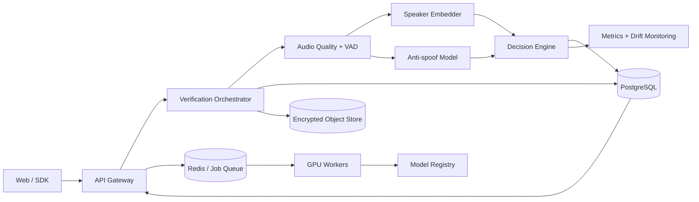

# VoiceID

VoiceID is a **speaker verification, voice attack detection, and action-authorization platform**.
Its purpose is not to recognize what was said, but to determine whether a voice sample belongs to
an enrolled identity, whether the audio appears authentic, and whether that evidence is sufficient
for a requested device action.

The repository combines a same-origin web experience, a versioned HTTP API, and a tested,
framework-independent domain core. Its delivered roadmap covers biometric evaluation,
anti-spoofing research, secure storage, and MLOps.

## What this project demonstrates

- Audio processing: normalization, voice activity detection, quality analysis, and segmentation.
- Deep learning: ECAPA-TDNN speaker embeddings and anti-spoofing classification.
- Biometric logic: enrollment, robust centroids, cosine scoring, and calibration.
- Product policy: server-owned action risk and allow, deny, or step-up decisions.
- Evaluation: FAR, FRR, EER, ROC-AUC, minDCF, and condition-based analysis.
- Architecture: decoupled domain logic, model adapters, APIs, workers, and events.
- MLOps: versioned datasets, experiment tracking, a model registry, and monitoring.
- Security and privacy: revocable templates, encryption, consent, and retention policies.

## Target architecture



See [the architecture document](docs/architecture.md) for component boundaries, evaluation criteria, the threat model, and the delivery roadmap.

Progress is tracked explicitly in the [delivery roadmap](docs/roadmap.md).

## Current status

- Browser-based enrollment and verification connected to the real API and ECAPA model.
- Python core for robust enrollment, cosine scoring, and anti-spoofing decision fusion.
- Defensive PCM WAVE decoding, 16 kHz resampling, signal normalization, and quality analysis.
- Replaceable energy-based VAD baseline with explicit speech segments.
- Real 192-dimensional ECAPA-TDNN speaker embeddings through a lazy SpeechBrain adapter.
- Multi-sample enrollment with quality gates, outlier rejection, and versioned templates.
- One-to-one speaker verification with auditable decisions and provisional policy versioning.
- Risk-aware action authorization for assistants, private content, messaging, purchases, and
  physical access, with mandatory step-up authentication for high-risk operations.
- Authenticated durable-device flow with signed 30-second capabilities, unique request nonces,
  device/action binding, hash-only token storage, and atomic one-time consumption.
- Versioned FastAPI endpoints with bounded multipart uploads and stable error contracts.
- Unit and contract tests covering audio capture encoding, the API, and biometric logic.
- Leakage-resistant scored-trial manifests with development-only minDCF threshold selection.
- Hash-locked PCM WAVE trial manifests and a real preprocessing + ECAPA scoring runner.
- Full-waveform FP32/INT8 ONNX export with hash-bound provenance and isolated ARM64 benchmarks.
- Swift companion SDK prototype for bounded Bluetooth-capable capture, policy callbacks, Keychain
  credentials, one-time grants, and explicit device-authentication/passkey boundaries.
- Deterministic LibriSpeech clean-subset import with provenance, license, and archive checksums.
- Published LibriSpeech clean evaluation with frozen scores and Wilson uncertainty intervals.
- Versioned anti-spoofing score protocol with leakage checks, calibration, uncertainty, and attack-level reporting.
- Integrity-checked AASIST adapter with isolated waveform preprocessing and explicit model lineage.
- Official ASVspoof 2021 LA reference-score reproduction with independently validated EER and t-DCF.
- End-to-end ASVspoof 2019 LA AASIST evidence over 96,081 trials, with 0.829511% held-out EER,
  0.0275295 min t-DCF, source hashes, and an explicit no-fusion decision.
- Consent-gated encrypted persistence with revocation, retention, tamper-evident audit, and rate limits.
- Docker/Compose, CI, model release integrity, Prometheus metrics, drift detection, and rollback controls.
- Target architecture and incremental roadmap.

The system remains experimental. Its clean-speech calibration evidence is insufficient to replace
the provisional speaker policy. Anti-spoofing is also disabled: the measured 2019 Logical Access
benchmark validates the adapter, but its development-selected threshold did not transfer safely to
held-out attacks and the corpus does not cover current deployment threats. VoiceID must not be
treated as a production biometric authentication system.

## Install the ML environment

The lockfile makes the local ML environment reproducible:

```bash
uv sync --extra ml --extra api --extra persistence --extra dev
```

Extract and validate an embedding from a 16-bit PCM WAVE file:

```bash
uv run python scripts/extract_embedding.py path/to/sample.wav
```

The command reports the model identifier, dimension, norm, and usable speech duration. It intentionally does not print the embedding values.

Run an ephemeral multi-sample enrollment:

```bash
uv run python scripts/enroll_identity.py demo-user sample-1.wav sample-2.wav sample-3.wav
```

This command exercises the real preprocessing and ECAPA pipeline but deliberately uses in-memory
persistence. The API's encrypted durable mode is documented separately.

Run the complete ephemeral enrollment and verification workflow:

```bash
uv run python scripts/verify_identity.py demo-user sample-1.wav sample-2.wav sample-3.wav \
  --probe probe.wav
```

The initial `provisional-cosine-v1` policy is useful for integration testing only. It has not been calibrated to a measured FAR, FRR, or EER.

Start the application:

```bash
uv run uvicorn voiceid.adapters.api.app:app --host 127.0.0.1 --port 8000
```

Open `http://127.0.0.1:8000` for the microphone workflow. After enrollment, select a protected
action to see how voice evidence and server-assigned risk produce different authorization outcomes.
Localhost is a secure browser context, so microphone capture is available after permission is
granted. The interactive API contract remains at `http://127.0.0.1:8000/docs`.

Read the [web workflow guide](docs/web.md) and [HTTP API guide](docs/api.md) for implementation details and limitations.
For restart-safe local operation, key management, consent, and revocation, read the
[durable persistence guide](docs/persistence.md).
For containers, CI, release lineage, monitoring, and rollback, read the
[MLOps and deployment guide](docs/mlops.md).
The [action authorization guide](docs/action-authorization.md) describes the wearable use cases,
risk matrix, trust boundary, and future OEM path.

## Run the tests

```bash
uv run python -W error -m unittest discover -s tests -p 'test_*.py'
node --test tests/web/audio.test.mjs
uv run ruff check .
uv run ruff format --check .
```

## First measured experiment

The [LibriSpeech clean v2 experiment](experiments/librispeech-clean-v2/README.md) publishes its protocol, provenance, raw scores, held-out metrics, and confidence intervals without committing voice recordings. At the development-selected threshold, the held-out cohort observed 0/30 false accepts and 1/30 false rejects. The corresponding 95% Wilson intervals are 0.00%–11.35% FAR and 0.59%–16.67% FRR, which makes the small-cohort uncertainty explicit.

The [ASVspoof 2021 LA reference reproduction](experiments/asvspoof2021-la-reference-v1/README.md)
validates VoiceID's EER and normalized t-DCF implementation against 148,176 official baseline-score
trials. Those organizer-provided scores validate metric compatibility, not VoiceID AASIST accuracy.

The [ASVspoof 2019 LA AASIST experiment](experiments/asvspoof2019-la-aasist-v1/README.md) scores all
96,081 official development/evaluation files end to end. It reports 0.829511% held-out raw-logit EER
and 0.0275295 min t-DCF, both exactly reproduced by the pinned upstream evaluator. The runner
verifies the publisher archive, safely extracts it, validates protocol counts, resumes through a
transactional ledger, and publishes only hash-bound non-audio evidence. The same report explains
why those in-domain figures do not justify enabling anti-spoofing in the default API. See the
[anti-spoofing protocol](docs/anti-spoofing.md) for score semantics and limitations.

## Reproduce the experiment

The importer, audio runner, metric layer, and strict contracts are available:

```bash
uv run python scripts/prepare_librispeech.py \
  --dev-clean data/raw/librispeech/extracted/LibriSpeech/dev-clean \
  --test-clean data/raw/librispeech/extracted/LibriSpeech/test-clean \
  --output data/raw/librispeech/voiceid-clean-v2
```

Then run the generated hash-locked manifest:

```bash
uv run python scripts/score_audio_trials.py path/to/audio-trials.json \
  --output /tmp/voiceid-scored-trials.json \
  --report /tmp/voiceid-evaluation-report.json
```

Use [the audio manifest template](examples/evaluation/audio-trials.example.json) for a different authorized corpus. The bundled examples are contract fixtures, not VoiceID accuracy results. LibriSpeech's public license is not individual biometric consent, and the generated audio remains ignored by Git. Read the [evaluation protocol](docs/evaluation.md) before interpreting a report.

## Engineering decisions

Important tradeoffs are recorded as Architecture Decision Records:

- [ADR 0001: Use a replaceable audio preprocessing pipeline](docs/decisions/0001-replaceable-audio-pipeline.md)
- [ADR 0002: Start with a pretrained ECAPA-TDNN speaker encoder](docs/decisions/0002-pretrained-ecapa-speaker-encoder.md)
- [ADR 0017: Export full-waveform ECAPA as static INT8 ONNX](docs/decisions/0017-export-full-waveform-ecapa-to-onnx.md)
- [ADR 0003: Keep the initial verification policy explicitly provisional](docs/decisions/0003-provisional-verification-policy.md)
- [ADR 0004: Expose a versioned HTTP boundary without coupling it to ML frameworks](docs/decisions/0004-versioned-http-api.md)
- [ADR 0005: Serve a same-origin web client with client-side PCM capture](docs/decisions/0005-same-origin-web-client.md)
- [ADR 0006: Calibrate on speaker-disjoint development trials](docs/decisions/0006-speaker-disjoint-calibration.md)
- [ADR 0007: Bind evaluation trials to hashed audio assets](docs/decisions/0007-hashed-audio-trials.md)
- [ADR 0008: Use speaker-disjoint LibriSpeech clean subsets](docs/decisions/0008-librispeech-clean-evaluation-corpus.md)
- [ADR 0009: Report Wilson intervals for locked-threshold error rates](docs/decisions/0009-wilson-error-rate-intervals.md)
- [ADR 0010: Evaluate anti-spoofing independently before tandem fusion](docs/decisions/0010-independent-countermeasure-evaluation.md)
- [ADR 0011: Preserve a separate waveform for the countermeasure](docs/decisions/0011-preserve-countermeasure-waveform.md)
- [ADR 0012: Do not retain raw audio by default](docs/decisions/0012-minimize-raw-biometric-retention.md)
- [ADR 0013: Checkpoint corpus inference without weakening evidence](docs/decisions/0013-checkpoint-corpus-inference.md)
- [ADR 0014: Publish aggregate biometric evidence only](docs/decisions/0014-publish-aggregate-biometric-evidence.md)
- [ADR 0015: Separate biometric evidence from action authorization](docs/decisions/0015-separate-biometric-and-action-policy.md)
- [ADR 0016: Issue short-lived, device-bound, single-use grants](docs/decisions/0016-short-lived-single-use-grants.md)
- [ADR 0018: Preserve server policy in the companion SDK](docs/decisions/0018-preserve-server-policy-in-companion-sdk.md)

Model behavior, provenance, intended use, and limitations are documented in the
[ECAPA-TDNN](docs/models/ecapa-tdnn.md) and [AASIST](docs/models/aasist.md) model cards.
The [edge inference profile](docs/edge-inference.md) documents the quantized ONNX candidate,
measured ARM64 behavior, channel-proxy degradation, and remaining phone/wearable gates.
The [VoiceIDKit prototype](sdk/swift/VoiceIDKit/README.md) documents the companion API, Bluetooth
capture boundary, local device authentication, and remaining passkey/server work.

## Technical references

- [SpeechBrain ECAPA-TDNN](https://speechbrain.readthedocs.io/en/stable/API/speechbrain.lobes.models.ECAPA_TDNN.html)
- [SpeechBrain VoxCeleb pretrained model](https://huggingface.co/speechbrain/spkrec-ecapa-voxceleb)
- [ASVspoof 2021](https://www.asvspoof.org/index2021.html)
- [MLflow Tracking](https://mlflow.org/docs/latest/tracking)

## Safety notice

Voice embeddings are biometric data. This project is currently intended for research and portfolio demonstration only. Production use would require informed consent, a documented retention policy, encryption, revocation, bias analysis, and jurisdiction-specific legal review.
