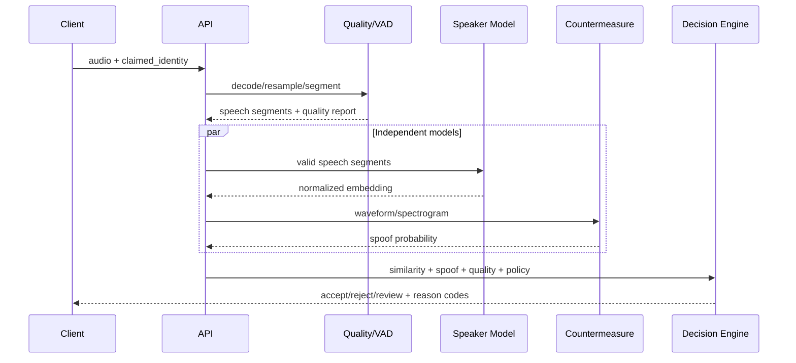

# VoiceID Architecture

## 1. Problem definition

VoiceID receives a voice sample and answers three independent questions:

1. Does the sample contain enough usable speech?
2. Does the voice match the claimed enrolled identity?
3. Does the signal appear bona fide, replayed, or synthetically generated?

These questions must remain separate. A high speaker similarity score does not prove that a sample is authentic, and bona fide audio does not prove that it belongs to the claimed speaker.

## 2. Inference pipeline



### Audio preprocessing

- Safely decode audio while enforcing duration and size limits.
- Convert input to 16 kHz mono PCM.
- Use voice activity detection to remove silence and measure effective speech duration.
- Calculate clipping, RMS, approximate SNR, and speech ratio.
- Reject unusable samples before expensive inference.

### Speaker encoder

ECAPA-TDNN produces a dense vector representing speaker characteristics. Enrollment combines several recordings into a robust centroid and removes inconsistent samples before storing the resulting voice template.

The initial backend uses cosine similarity. Later experiments will compare adaptive score normalization and PLDA. Thresholds must be calibrated on a development set against an explicit cost function rather than selected manually.

### Anti-spoofing countermeasure

An independent model analyzes artifacts introduced by speech synthesis, voice conversion, and replay. It will be trained and evaluated against the ASVspoof Logical Access, Physical Access, and Deepfake protocols. Speaker verification and countermeasure metrics remain separate in addition to the tandem system metric.

### Decision engine

The policy combines the speaker score, spoof probability, audio quality, speech duration, model version, and operation risk. It returns an explicit `accept`, `reject`, or `review` decision with auditable reason codes. Quality failures are never hidden inside a biometric score.

## 3. Deployable components

| Component | Responsibility | Planned technology |
|---|---|---|
| Web | Enrollment, verification, and result presentation | ES modules now; TypeScript / React when product complexity requires it |
| API | Contracts, authentication, and rate limiting | FastAPI / Pydantic |
| Orchestrator | Pipeline execution and policy enforcement | Python |
| Inference worker | VAD, speaker embeddings, and anti-spoofing | PyTorch / ONNX Runtime |
| Job queue | Long-running inference and backpressure | Redis |
| Metadata store | Identities, sessions, and audit records | PostgreSQL |
| Audio store | Encrypted samples with expiration policies | S3 / MinIO |
| Experiment system | Runs, metrics, artifacts, and lineage | MLflow |
| Observability | Latency, errors, traces, and drift | OpenTelemetry / Prometheus |

The system begins as a modular monolith. The API, domain, and adapters share one deployment until load characteristics or GPU utilization justify independent workers.

## 4. Code boundaries

```text
src/voiceid/
├── domain/          # Pure rules without frameworks or concrete models
├── application/     # Enroll, verify, and evaluate use cases
├── ports/           # Protocols for models, storage, and events
└── adapters/        # SpeechBrain, anti-spoof model, PostgreSQL, S3, and HTTP
    └── api/web/      # Packaged same-origin browser client and static assets

tests/web/            # Framework-free WAVE encoder tests
```

The domain layer does not import FastAPI, PyTorch, or a database client. This allows decision rules to be tested with deterministic vectors and lets model implementations change without modifying business rules.

Evaluation follows the same boundary: pure domain metrics consume finite labeled scores, the application layer locks a development-selected threshold, and a strict JSON adapter handles dataset manifests and reports. Model inference remains a separate scoring stage so a held-out evaluation set cannot silently influence policy selection.

## 5. Data model

- `Identity`: logical subject, lifecycle state, and consent policy.
- `Enrollment`: a set of samples processed by a specific pipeline version.
- `VoiceTemplate`: normalized centroid, model identifier, dimension, and expiration date.
- `VerificationAttempt`: scores, quality report, decision, and reason codes.
- `ModelRelease`: artifact, dataset lineage, thresholds, and evaluation metrics.

Recordings and templates are not equivalent assets. They are stored separately and follow different retention policies. A production template must be encrypted, versioned, revocable, and access-controlled.

## 6. Evaluation strategy

### Speaker verification

- **FAR:** proportion of impostor attempts incorrectly accepted.
- **FRR:** proportion of genuine attempts incorrectly rejected.
- **EER:** operating point where FAR and FRR are equal.
- **minDCF:** minimum weighted cost for the intended operating scenario.
- DET/ROC curves and calibration analysis by device, noise, language, and duration.

### Anti-spoofing

- Countermeasure EER.
- Minimum tandem detection cost function for the combined system.
- Separate Logical Access, Physical Access, and Deepfake results.
- Out-of-distribution testing with unseen codecs and generators.

### Operational performance

- p50, p95, and p99 latency plus real-time factor.
- Speaker-score distribution and quality-failure rates.
- Embedding drift monitoring without placing raw audio in telemetry.

## 7. Minimum threat model

- Replay of a genuine user's recording.
- Synthetic or cloned speech.
- Voice conversion.
- Direct file injection into the verification endpoint.
- Fraudulent enrollment.
- Voice-template theft or cross-service correlation.
- High-volume attempts and identity enumeration.

Controls include optional challenge phrases, anti-spoofing, session liveness, rate limits, encryption, expiration, audit trails, and separation between public identifiers and internal identities.

## 8. Incremental delivery plan

### Phase 1 — Scientific baseline

- Versioned dataset manifest.
- VAD and audio quality gates.
- Pretrained ECAPA-TDNN inference.
- Reproducible benchmark and EER report.
- Local enrollment and verification API.

### Phase 2 — Anti-fraud system

- RawNet2 or AASIST baseline on ASVspoof.
- Decision fusion and minimum tandem DCF.
- Automated replay and synthetic-audio tests.

### Phase 3 — Product architecture

- PostgreSQL, object storage, jobs, consent, and retention workflows.
- Authentication, rate limiting, audit trail, and observability.
- Web SDK and verification-attempt dashboard.

### Phase 4 — MLOps and production readiness

- DVC or checksum-based manifests for dataset lineage.
- MLflow experiment tracking and model registry.
- CI with unit tests, model evaluation, and container scanning.
- Canary releases, drift monitoring, and model rollback.
