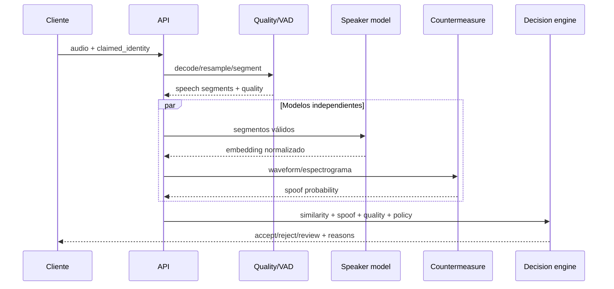

# Arquitectura de VoiceID

## 1. Problema

VoiceID recibe una muestra de voz y responde tres preguntas distintas:

1. ¿Contiene suficiente voz utilizable?
2. ¿La voz coincide con la identidad registrada?
3. ¿La señal parece genuina o corresponde a un replay/deepfake?

Separar estas preguntas es importante: una similitud alta no implica autenticidad y un audio genuino no implica que pertenezca al usuario.

## 2. Pipeline de inferencia



### Preprocesamiento

- Decodificación segura y límite de duración/tamaño.
- Conversión mono PCM a 16 kHz.
- VAD para retirar silencios y estimar duración efectiva.
- Métricas: clipping, RMS, SNR aproximado y porcentaje de voz.
- Rechazo temprano de muestras insuficientes.

### Speaker encoder

ECAPA-TDNN produce un vector denso que representa rasgos del hablante. El enrollment usa varias muestras y crea un centroide robusto; las muestras atípicas se excluyen antes de guardar la plantilla.

El score inicial será similitud coseno. Después se compararán adaptive score normalization y PLDA. Los thresholds nunca se eligen “a ojo”: se calibran con un conjunto de desarrollo y una función de coste.

### Anti-spoofing

Un modelo independiente analiza artefactos de síntesis, conversión y replay. Se entrenará/evaluará con los protocolos LA, PA y DF de ASVspoof. Speaker verification y countermeasure conservarán métricas separadas además de una métrica tándem.

### Decision engine

La política combina score de identidad, probabilidad de spoof, calidad, duración de voz, versión del modelo y nivel de riesgo. Devuelve una decisión explícita (`accept`, `reject`, `review`) y reason codes auditables. No oculta errores de calidad dentro de un score biométrico.

## 3. Componentes desplegables

| Componente | Responsabilidad | Tecnología prevista |
|---|---|---|
| Web | enrollment, verificación, resultados | TypeScript / React |
| API | contratos, autenticación, rate limiting | FastAPI / Pydantic |
| Orchestrator | pipeline y políticas | Python |
| Inference worker | VAD, embeddings, anti-spoof | PyTorch / ONNX Runtime |
| Job queue | inferencia larga y backpressure | Redis |
| Metadata | identidades, sesiones, auditoría | PostgreSQL |
| Audio store | muestras cifradas con TTL | S3/MinIO |
| Experiments | runs, métricas, artefactos | MLflow |
| Observability | latencia, errores, drift | OpenTelemetry / Prometheus |

Se comienza como modular monolith. API, dominio y adaptadores viven en el mismo despliegue y se separan en workers solo cuando la carga o el uso de GPU lo justifique.

## 4. Límites del código

```text
src/voiceid/
├── domain/          # reglas puras, sin frameworks ni modelos concretos
├── application/     # casos de uso: enroll, verify, evaluate
├── ports/           # protocolos para storage, modelos y eventos
└── adapters/        # SpeechBrain, ASVspoof model, Postgres, S3, HTTP
```

El dominio no importa FastAPI, PyTorch ni una base de datos. Esto permite probar decisiones con vectores deterministas y cambiar modelos sin modificar reglas de negocio.

## 5. Modelo de datos

- `Identity`: sujeto lógico, estado y política de consentimiento.
- `Enrollment`: conjunto de muestras y versión del pipeline.
- `VoiceTemplate`: centroide normalizado, modelo, dimensión y fecha de expiración.
- `VerificationAttempt`: scores, quality report, decisión y reason codes.
- `ModelRelease`: artefacto, dataset lineage, thresholds y métricas.

Las grabaciones y las plantillas no son equivalentes: se almacenan por separado, con políticas de retención distintas. En producción, la plantilla debe cifrarse, versionarse y poder revocarse.

## 6. Evaluación

### Speaker verification

- FAR: impostores aceptados.
- FRR: usuarios legítimos rechazados.
- EER: punto donde FAR y FRR se cruzan.
- minDCF: coste mínimo ponderado según el escenario.
- Curvas DET/ROC y calibración por dispositivo, ruido, idioma y duración.

### Anti-spoofing

- EER de countermeasure.
- min t-DCF para medir el sistema junto con speaker verification.
- Resultados separados para logical access, physical access y deepfake.
- Pruebas fuera de distribución con codecs y generadores no vistos.

### Operación

- p50/p95/p99 de latencia y real-time factor.
- distribución de scores y quality failures.
- drift de embeddings sin registrar audio crudo en telemetría.

## 7. Threat model mínimo

- Replay de una grabación del usuario.
- Voz sintetizada o clonada.
- Voice conversion.
- Inyección directa de archivos al endpoint.
- Enrollment fraudulento.
- Robo o correlación de plantillas biométricas.
- Abuso por intentos masivos y enumeración de identidades.

Los controles incluyen challenge phrases opcionales, anti-spoofing, rate limits, liveness por sesión, cifrado, TTL, auditoría y separación entre identificador público e identidad interna.

## 8. Plan incremental

### Fase 1 — baseline científico

- Dataset manifest versionado.
- VAD y quality gates.
- ECAPA-TDNN preentrenado.
- Benchmark reproducible y reporte EER.
- API local de enrollment/verification.

### Fase 2 — sistema antifraude

- Baseline RawNet2/AASIST sobre ASVspoof.
- Decision fusion y min t-DCF.
- Ataques de replay y audio sintético en pruebas.

### Fase 3 — arquitectura de producto

- PostgreSQL, object storage, jobs y consent/retention flows.
- Autenticación, rate limiting, audit trail y observabilidad.
- SDK web y dashboard de intentos.

### Fase 4 — MLOps y producción

- DVC o manifests con checksums para datasets.
- MLflow para runs, registry y lineage.
- CI con tests, image scanning y evaluación de modelos.
- Canary release, monitoring de drift y rollback.
